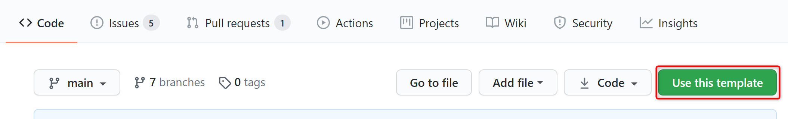
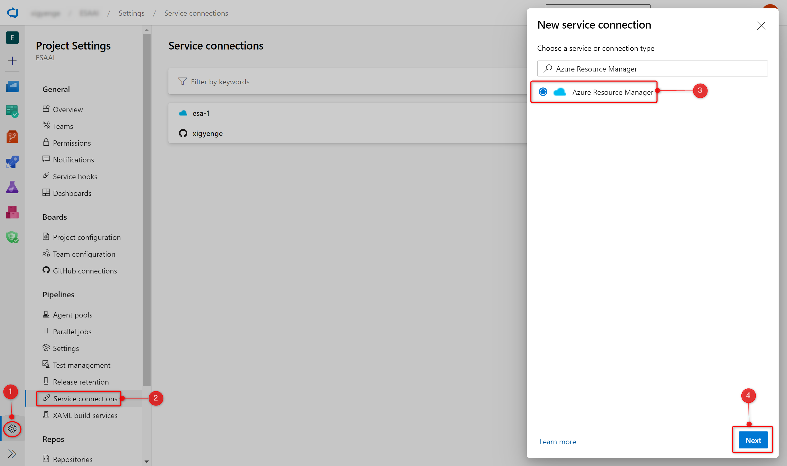

# Enterprise Scale Analytics - Data Landing Zone

> **General disclaimer** Please be aware that this template is in public preview. Therefore, expect smaller bugs and issues when working with the solution. Please submit an Issue, if you come across any issues that you would like us to fix.

# Description 
A Data Landing Zone has several layers to enable agility to service the Data Domains and Data Products under the data landing zone. A new Data Landing Zone is always deployed with a standard set of services to enable the entity to start ingesting and analysing data.

## What will be deployed?

By default, all the services which comes under Data Landing Zone are enabled and you must explicitly disable them if you don't want it to be deployed. 
    <p align="center">
         
    </p>


 - [Azure Virtual Network](https://docs.microsoft.com/en-us/azure/virtual-network/virtual-networks-overview)
 - [Network Security Groups](https://docs.microsoft.com/en-us/azure/virtual-network/network-security-groups-overview)
 - [Route Tables](https://docs.microsoft.com/en-us/azure/virtual-network/virtual-networks-udr-overview)
 - [Azure Key Vault](https://docs.microsoft.com/en-us/azure/key-vault/general)
 - [Storage Account](https://docs.microsoft.com/en-us/azure/storage/common/storage-account-overview)
 - [Data Lake Storage Gen2](https://docs.microsoft.com/en-us/azure/storage/blobs/data-lake-storage-introduction)
 - [Azure Data Factory](https://docs.microsoft.com/en-us/azure/data-factory/)
 - [Self Hosted Integration Runtime](https://docs.microsoft.com/en-us/azure/data-factory/create-self-hosted-integration-runtime)
 - [Log Analytics](https://docs.microsoft.com/en-us/azure/azure-monitor/learn/quick-create-workspace)
 - [SQL Server](https://docs.microsoft.com/en-us/sql/sql-server/?view=sql-server-ver15)
 - [Azure SQL Database](https://docs.microsoft.com/en-us/azure/azure-sql/database/)
 - [Synapse Workspace](https://docs.microsoft.com/en-us/azure/synapse-analytics/)
 - [Azure Databricks](https://docs.microsoft.com/en-us/azure/databricks/)
 - [Event Hub](https://docs.microsoft.com/en-us/azure/event-hubs/)

You have two options for deploying this reference architecture:
1. Use the `Deploy to Azure` Button or
2. Use GitHub Actions or Azure DevOps Pipelines.

# Option 1: Deploy to Azure - Quickstart

| Data Landing Zone |
|:--------------|
[](https%3A%2F%2Fraw.githubusercontent.com%2FAzure%2Fdata-node%2Fmain%2Fdocs%2Freference%2Fdeploy.dataNode.json)
    
# Option 2: GitHub Actions or Azure DevOps Pipelines

## 1. Prerequisites

The following prerequisites are required to make this repository work:
* Azure subscription
* [User Access Administrator](https://docs.microsoft.com/en-us/azure/role-based-access-control/built-in-roles#user-access-administrator) or [Owner](https://docs.microsoft.com/en-us/azure/role-based-access-control/built-in-roles#owner) access to the subscription to be able to create a service principal and add it to the subscription.

If you don’t have an Azure subscription, [create your Azure free account today](https://azure.microsoft.com/en-us/free/).

## 2. Create repository from a template

1. On GitHub, navigate to the [main page of the repository](/).
2. Above the file list, click **Use this template**

<p align="center">
  
</p>

3. Use the **Owner** drop-down menu, and select the account you want to own the repository.
<p align="center">
  
</p>

4. Type a name for your repository, and an optional description.
5. Choose a repository visibility. For more information, see "[About repository visibility](https://docs.github.com/en/github/creating-cloning-and-archiving-repositories/about-repository-visibility)."
6. Optionally, to include the directory structure and files from all branches in the template, and not just the default branch, select **Include all branches**.
7. Click **Create repository from template**.

## 3. Setting up the required Service Principal and access

A service principal needs to be generated for authentication and authorization from GitHub or Azure DevOps to your Azure subscription. This is required to deploy resources to your environment. Just go to the Azure Portal to find the id of your subscription. Then start CLI or PowerShell, login to Azure, set the Azure context and execute the following commands to generate the required credentials:

**Azure CLI**
```Shell
# Replace {service-principal-name} and {subscription-id}  with your 
# Azure subscription id and any name for your service principal.
az ad sp create-for-rbac \
  --name {service-principal-name} \
  --role contributor \
  --scopes /subscriptions/{subscription-id} \
  --sdk-auth
```

**Azure Powershell**
```PowerShell
# Replace {service-principal-name} and {subscription-id}  with your 
# Azure subscription id and any name for your service principal.
New-AzADServicePrincipal `
  -DisplayName "{service-principal-name}" `
  -Role contributor `
  -Scope "/subscriptions/{subscription-id}"
```
This will generate the following JSON output:

```JSON
{
  "clientId": "<GUID>",
  "clientSecret": "<GUID>",
  "subscriptionId": "<GUID>",
  "tenantId": "<GUID>",
  (...)
}
```

Take note of the output. It will be required for the next steps.
This service principal now also requires the following access rights:


Now you can choose, whether you would like to use GitHub Actions or Azure DevOps for your deployment.

## 4. a) GitHub Actions

If you want to use GitHub Actions for deploying the resources, add the previous JSON output as a [repository secret](https://docs.github.com/en/actions/reference/encrypted-secrets#creating-encrypted-secrets-for-a-repository) with the name `AZURE_CREDENTIALS` in your GitHub repository:

<p align="center">
  
</p>

To do so, execute the following steps:

1. On GitHub, navigate to the [main page of the repository](/).
2. Under your repository name, click on the **Settings** tab.
3. In the left sidebar, click **Secrets**.
4. Click **New repository secret**.
5. Type the name `AZURE_CREDENTIALS` for your secret in the Name input box.
6. Enter the JSON output from above as value for your secret.
7. Click **Add secret**.

## 4. b) Azure DevOps

If you want to use Azure DevOps Pipelines for deploying the resources, you need to create an Azure Resource Manager service connection. To do so, execute the following steps:

1. In Azure DevOps, open the **Project settings**.
2. Now, select the **Service connections** page from the project settings page.
3. Choose **New service connection** and select **Azure Resource Manager**.
4. On the next page select **Service principal (manual)**.
5. Select the appropriate environment to which you would like to deploy the templates. Default and tested option is **Azure Cloud**.
6. For the **Scope Level**, select **Subscription** and enter your subscription Id and name.
7. Enter the details of the service principal that we have generated in step 3 (**Service Principal Id** = **clientId**, **Service Principal Key** = **clientSecret**, **Tenant ID** = **tenantId**) and click on **Verify** to make sure that the connection works.
8. Enter a user-friendly **Connection name** to use when referring to this service connection. Take note of the name, because this will be required in the parameter update process. 
9. Optionally, enter a **Description**.
10. Click on **Verify and save**.

More information can be found [here](https://docs.microsoft.com/en-us/azure/devops/pipelines/library/connect-to-azure?view=azure-devops#create-an-azure-resource-manager-service-connection-with-an-existing-service-principal).

## 5. Parameter Update Process

In order to deploy the ARM templates in this repository to the desired Azure subscription, you'll need to modify some parameters in the forked repository. As updating each parameter file manually is a time consuming process, which could lead as well to undesired user errors, we have simplified the process witha  GitHub Action workflow. After successfully executing the previous steps, please open the <a href="/.github/workflows/updateParameters.yml">`/.github/workflows/updateParameters.yml"` YAML file</a>. In this file you need to update the environment variables. Once you commit the file with the updated values, a GitHub Action workflow will be triggered that replaces all parameters accordingly. Just click on <a href="/.github/workflows/updateParameters.yml">`/.github/workflows/updateParameters.yml"`</a> and edit the following section: 


```YAML
env:
  GLOBAL_DNS_RESOURCE_GROUP_ID: '<my-global-dns-resource-group-resource-id>'
  DATA_LANDING_ZONE_SUBSCRIPTION_ID: '<my-data-landing-zone-subscription-id>'
  DATA_LANDING_ZONE_NAME: '<my-data-landing-zone-name>'  # Choose ~5 characters. Will be used as a prefix for services. If not unique, deployment can fail for some services.
  LOCATION: '<my-region>'
  AZURE_RESOURCE_MANAGER_CONNECTION_NAME: '<my-resource-manager-connection-name>'
  HUB_VNET_ID: '<my-hub-vnet-id>'
```

The parameters have the following meaning:

| Parameter                                | Description  | Sample value |
|:-----------------------------------------|:-------------|:-------------|
| GLOBAL_DNS_RESOURCE_GROUP_ID             | Specifies the global DNS resource group resource ID which gets deployed with the [Data Management Landing Zone](https://github.com/Azure/data-hub) | `/subscriptions/xxxxxxxx-xxxx-xxxx-xxxx-xxxxxxxxxxxx/resourceGroups/my-subscription` |
| DATA_LANDING_ZONE_SUBSCRIPTION_ID        | Specifies the subscription ID of the Data Landing Zone where all the resources will be deployed | `xxxxxxxx-xxxx-xxxx-xxxx-xxxxxxxxxxxx` |
| DATA_LANDING_ZONE_NAME                   | Specifies the name of your Data Landing Zone. The value should consist of alphanumeric characters (A-Z, a-z, 0-9) and should not contain any special characters like `-`, `_`, `.`, etc. Special characters will be removed in the renaming process. | `mynode01` |
| LOCATION                                 | Specifies the region where you want the resources to be deployed. | `northeurope` |
| AZURE_RESOURCE_MANAGER_CONNECTION_NAME   | Specifies the resource manager connection name in Azure DevOps. You can leave the default value, if you want to use GitHub Actions for your deployment. More details on how to create the resource manager connection in Azure DevOps can be found in step 4. b) or [here](https://docs.microsoft.com/en-us/azure/devops/pipelines/library/connect-to-azure?view=azure-devops#create-an-azure-resource-manager-service-connection-with-an-existing-service-principal). | `my-connection-name` |
| HUB_VNET_ID                              | Specifies the resource ID of the vnet to which the landing zone vnet should be peered with. We are recommending a mesh network design for the overall data platform, which is why you might have to add additional peering deployments to your forked repository. | `/subscriptions/xxxxxxxx-xxxx-xxxx-xxxx-xxxxxxxxxxxx/resourceGroups/my-network-rg/providers/Microsoft.Network/virtualNetworks/my-vnet` |

After updating the values, please commit the updated version to the `main` branch. This will kick off a GitHub Action workflow, which will appear under the **Actions** tab of the [main page of the repository](/). The `Update Parameter Files` workflow will update all parameters in your repository according to a certain naming convention. Once the process has finished, it will open a Pull Request in your repository, where you can review the changes made by the workflow. Please follow the instructions in the Pull Request to complete the parameter update process. We are not renaming the environment variables in the workflow files, because this can have undesired outcomes of kicking of an infinite number of workflows. 

After following the instructions in the Pull request, you can merge the pull request back into the `main` branch of your repository by clicking on **Merge pull request**. Finally, you can click on **Delete branch** to clean up your repository.

## 6. (not applicable for GH Actions) Reference pipeline from GitHub repository in Azure DevOps pipelines


## 7. Follow the workflow deployment

Congratulations! You have successfully executed all steps to deploy the template to your environment through GitHub Actions or Azure DevOps.

If you are using GitHub Actions, you can navigate to the **Actions** tab of the [main page of the repository](/), where you will see a workflow with the name `Data Node Deployment` running. Click on it to see how it deploys one service after another. If you run into any issues, please open an issue [here](https://github.com/Azure/data-hub/issues).

If you are using Azure DevOps Pipelines, you can navigate to the pipeline that you have created as part of step 6 and follow  how it deploys one service after another. If you run into any issues, please open an issue [here](https://github.com/Azure/data-hub/issues).

# Enterprise Scale Analytics Documentation and Implementation

* [Documentation](https://github.com/Azure/Enterprise-Scale-Analytics)
- [Implementation - Data Management](https://github.com/Azure/data-hub)
- [Implementation - Data Landing Zone](https://github.com/Azure/data-node)
- [Implementation - Data Domain - Batch](https://github.com/Azure/data-domain)
- [Implementation - Data Domain - Streaming](https://github.com/Azure/data-domain-streaming)
- [Implementation - Data Product - Reporting](https://github.com/Azure/data-product)
- [Implementation - Data Product - Data Science](https://github.com/Azure/data-product-analytics)

### Creating the Azure Resource Manager Connection
To allow Azure DevOps Server to be integrated with Azure services, you will need to create an Azure Service Principal that will allow the deployments. The name of this connection will be parsed in the environment variables inside the workflow deployment. 

>  Note: Please make sure you have the right priviliges to create a Service Principal inside your subscription.

 1. On your Azure DevOps Project, navigate to **Project Settings** and Select **Service Connections**. 
 2. From the **New service connection** dropdown, select **Azure Resource Manager** (automatic or manual)
    <p align="center">
    
    </p>


 3. Set the **Connection name** to something descriptive. You will need to create a service principal in Azure in the next task to fill out the remaining fields. For this, please follow the instructions from *3. Setting up the required secrets*
 4. Now that you have completed the requried fields, click **Verify connection** to make sure the values work as expected. Click **OK** when verified. You will now be able to reference this connection from release pipeline tasks and parse the name in the env variable **AZURE_RESOURCE_MANAGER_CONNECTION_NAME**
    <p align="center">
     
    </p>


Once you save your changes to the file, one last step to complete. Please update the GitHub Workflow environment variables in <a href="/.github/workflows/dataNodeDeployment.yml">`/.github/workflows/dataNodeDeployment.yml"` file</a>. 
After completing, just commit and make a Pull Request so the workflow will trigger and run the <a href="/configs/UpdateParameters.ps1">`/configs/UpdateParameters.ps1"` file</a>, which is updating all the variables used in the ARM Templates and you will be ready to deploy the services. 


<!-- ## Setup for GH Workflows

## Setup for ADO Workflow

### Access Requierements -->

# Connecting ADO to GitHub to deploy through ADO
In case you want to deploy the templates through ADO, please follow the below steps on how to integrate ADO with GitHub using Azure DevOps pipeline. 
### Prerequisites
* An Azure DevOps account from https://dev.azure.com.
* A GitHub account from https://github.com.

**1. Install Azure DevOps Pipelines** 

1. If you are not signed in to GitHub, sign in now.
2. Choose the repository that you wish to connect to Azure DevOps. In case you do not have any repositories forked, please follow the instructions from *2. Create repository from a template*
3. Click **Marketplace** from the top navigation to visit it and search for **Azure Pipelines**. The Azure Pipelines offering is free for anyone to use for public repositories, and free for a single build queue if you’re using a private repository. 
        <p align="center">
                                                         
         </p>

4. Select it and click on **Install it for free**
        <p align="center">
        
        </p>
5. If you have multiple **GitHub** accounts, select the one you forked this repository to from the **Switch billing account** dropdown. 
6. You may be prompted to confirm your GitHub password to continue. 
7. You may be prompted to log in to your Microsoft account. Make sure you are loged into the one associated with your Azure DevOps account.


**2. Configuring Azure Pipelines project**

1. Now you will need to set up your Azure Pipelines project. Create (or select in case you have already created) the Azure DevOps **organization** you would like to perform these builds under, as well as the Azure DevOps **project** from that organization you would like to use.  Click **Continue**.
     <p align="center">
    
    </p>

2.  Select **Pipelines** and click on **Create** button in order to create a new pipeline.
    <p align="center">
    
    </p>
 
3. Choose where your code is - in this scenario, you have your code in the forked GitHub Repo, therefor, you will choose GitHub using Yaml.
    <p align="center">
    
    </p>
    
4. Once you choose the source, search after your forked repository, in this example **data-node** inside **My Repositories** and select it. 
      <p align="center">
    
    </p>
    
5. In case you have not installed Azure Pipelines in the prior steps, you will be prompted a window for installing it now and allowing to access the app. 
6. After connected to the forked repo, you will need to configure your pipeline. You can either start a new pipeline which you will work on or you can use an existing yaml file. For this project, you will use the existing yaml file which exists in your forked repo. Now, you just need to choose the **branch** on which you will work on and select the path to the ADO workflow file. 
    <p align="center">
        
    </p>
    
7. Click **run** to save the pipeline and queue a new build. It will take some minutes for the pipeline to complete. During this time it will configure the build agent, pull in the source from GitHub, and build it according to the pipeline definition.


# Contributing

This project welcomes contributions and suggestions.  Most contributions require you to agree to a
Contributor License Agreement (CLA) declaring that you have the right to, and actually do, grant us
the rights to use your contribution. For details, visit https://cla.opensource.microsoft.com.

When you submit a pull request, a CLA bot will automatically determine whether you need to provide
a CLA and decorate the PR appropriately (e.g., status check, comment). Simply follow the instructions
provided by the bot. You will only need to do this once across all repos using our CLA.

This project has adopted the [Microsoft Open Source Code of Conduct](https://opensource.microsoft.com/codeofconduct/).
For more information see the [Code of Conduct FAQ](https://opensource.microsoft.com/codeofconduct/faq/) or
contact [opencode@microsoft.com](mailto:opencode@microsoft.com) with any additional questions or comments.
