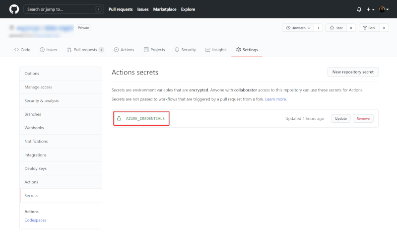

# Enterprise Scale Analytics and AI - Data Landing Zone

> **General disclaimer:** Please be aware that this template is in private preview. Therefore, expect smaller bugs and issues when working with the solution. Please submit an Issue in GitHub if you come across any issues that you would like us to fix.

**DO NOT COPY - UNDER DEVELOPMENT - MS INTERNAL ONLY - Please be aware that this template is in private preview without any SLA.**

## Description

A Data Landing Zone in the [**Enterprise Scale Analytics and AI**](https://github.com/Azure/Enterprise-Scale-Analytics) solution pattern has several layers to enable agility to service the Data Integrations and Data Products within the data landing zone. A new Data Landing Zone is always deployed with a standard set of services to enable the entity to start ingesting and analyzing data.

## What will be deployed?

By default, all the services which come under Data Landing Zone are enabled, and you must explicitly disable services that you don't want to be deployed.

> **Note:** Before deploying the resources, we recommend to check registration status of the required resource providers in your subscription. For more information, see [Resource providers for Azure services](https://docs.microsoft.com/azure/azure-resource-manager/management/resource-providers-and-types).


For each data landing zone, the following services are created:

- [Virtual Network](https://docs.microsoft.com/azure/virtual-network/virtual-networks-overview)
- [Network Security Groups](https://docs.microsoft.com/azure/virtual-network/network-security-groups-overview)
- [Route Tables](https://docs.microsoft.com/azure/virtual-network/virtual-networks-udr-overview)
- [Key Vault](https://docs.microsoft.com/azure/key-vault/general)
- [Storage Account](https://docs.microsoft.com/azure/storage/common/storage-account-overview)
- [Data Lake Storage Gen2](https://docs.microsoft.com/azure/storage/blobs/data-lake-storage-introduction)
- [Data Factory](https://docs.microsoft.com/azure/data-factory/)
- [Self-Hosted Integration Runtime](https://docs.microsoft.com/azure/data-factory/create-self-hosted-integration-runtime)
- [Log Analytics](https://docs.microsoft.com/azure/azure-monitor/learn/quick-create-workspace)
- [SQL Server](https://docs.microsoft.com/sql/sql-server/?view=sql-server-ver15)
- [SQL Database](https://docs.microsoft.com/azure/azure-sql/database/)
- [Synapse Workspace](https://docs.microsoft.com/azure/synapse-analytics/)
- [Databricks](https://docs.microsoft.com/azure/databricks/)
- [Event Hub](https://docs.microsoft.com/azure/event-hubs/)

For more details regarding the services that will be deployed, please read the [Data Landing Zone](https://github.com/Azure/Enterprise-Scale-Analytics/tree/main/docs/03-datalandingzones) guide in the Enterprise Scale Analytics and AI documentation.

You have two options for deploying this reference architecture:

1. Use the `Deploy to Azure` button for an immediate deployment
2. Use GitHub Actions or Azure Pipelines for an automated, repeatable deployment

## Prerequisites

> **Note:** Please make sure you have successfully deployed a [Data Management Landing Zone](https://github.com/Azure/data-management-zone). The Data Landing Zone relies on the Private DNS Zones that are deployed in the Data Management Template. If you have Private DNS Zones deployed elsewhere, you can also point to these. If you do not have the Private DNS Zones deployed for the respective services, this template deployment will fail.

The following prerequisites are required to make this repository work:

- A **Data Management Landing Zone** deployed. For more information, check the [Data Management Landing Zone](https://github.com/Azure/data-management-zone) repo.
- an Azure subscription
- [User Access Administrator](https://docs.microsoft.com/azure/role-based-access-control/built-in-roles#user-access-administrator) or [Owner](https://docs.microsoft.com/azure/role-based-access-control/built-in-roles#owner) access to the subscription to be able to create a service principal and role assignments for it.
- For deployment, please choose one of the below **Supported Regions** list.

### **Supported Regions:**

- Asia Southeast
- Europe North
- Europe West
- France Central
- Japan East
- South Africa North
- UK South
- US Central
- US East
- US East 2
- US West 2

If you don't have an Azure subscription, [create your Azure free account today](https://azure.microsoft.com/free/).

## Option 1: Deploy to Azure - Quickstart (Coming soon ...)

| Data Landing Zone |
|:------------------|
<!-- [](https://portal.azure.com/#create/Microsoft.Template/uri/https%3A%2F%2Fraw.githubusercontent.com%2FAzure%2Fdata-landing-zone%2Fmain%2Fdocs%2Freference%2Fdeploy.dataNode.json) -->


## Option 2: GitHub Actions or Azure Pipelines

### 1. Create repository from a template

1. On GitHub, navigate to the main page of this repository.
1. Above the file list, click **Use this template**

    

1. Use the **Owner** drop-down menu and select the account you want to own the repository.

      

1. Type a name for your repository and an optional description.
1. Choose a repository visibility. For more information, see "[About repository visibility](https://docs.github.com/en/github/creating-cloning-and-archiving-repositories/about-repository-visibility)."
1. Optionally, to include the directory structure and files from all branches in the template and not just the default branch, select **Include all branches**.
1. Click **Create repository from template**.

### 2. Setting up the required Service Principal and access

A service principal with *Contributor* role needs to be generated for authentication and authorization from GitHub or Azure DevOps to your Azure **Data Landing Zone** subscription. This is required to deploy the data landing zone resources to your environment. Just go to the Azure Portal to find the ID of your subscription. Then start the Cloud Shell or Azure CLI, login to Azure, set the Azure context and execute the following commands to generate the required credentials:

#### Azure CLI

```sh
# Replace {service-principal-name} and {subscription-id} with your
# Azure subscription id and any name for your service principal.
az ad sp create-for-rbac \
  --name "{service-principal-name}" \
  --role "Contributor" \
  --scopes "/subscriptions/{subscription-id}" \
  --sdk-auth
```

This will generate the following JSON output:

```json
{
  "clientId": "<GUID>",
  "clientSecret": "<GUID>",
  "subscriptionId": "<GUID>",
  "tenantId": "<GUID>",
  (...)
}
```

> **Note:** Take note of the output. It will be required for the next steps.

For automation purposes, a few more role assignments are required for this service principal.

> **Note:** The number of role assignments can be further reduced in a production scenario. The **Network Contributor** role assignment is just required in this repository to automatically setup the vnet peering between the data management landing zone and the data landing zone. Without this, DNS resolution will not work and in- and outbound traffic will be dropped because there is no line of sight to the Azure Firewall. The **Private DNS Zone Contributor** is also not required if the deployment of DNS A-records of the Private Endpoints is automated through Azure Policies with `deployIfNotExists` effect. The same is true for the **User Access Administrator** because the deployment can be automated using `deployIfNotExists` policies.

Additional required role assignments include:

| Role Name | Description | Scope |
|:----------|:------------|:------|
| [Private DNS Zone Contributor](https://docs.microsoft.com/azure/role-based-access-control/built-in-roles#private-dns-zone-contributor) | We expect you to deploy all Private DNS Zones for all data services into a single subscription and resource group. Therefor, the service principal needs to be Private DNS Zone Contributor on the global dns resource group which was created during the Data Management Zone deployment. This is required to deploy A-records for the respective private endpoints.| <div style="width: 31ch">(Resource Group Scope) `/subscriptions/{{datamanagement}subscriptionId}/resourceGroups/{resourceGroupName}`</div> |
| [Network Contributor](https://docs.microsoft.com/azure/role-based-access-control/built-in-roles#network-contributor) | In order to setup vnet peering between the Data Landing Zone vnet and the Data Management Landing Zone vnet, the service principal needs **Network Contributor** access rights on the resource group of the remote vnet. | <div style="width: 31ch">(Resource Group Scope) `/subscriptions/{{datamanagement}subscriptionId}/resourceGroups/{resourceGroupName}`</div> |
| [User Access Administrator](https://docs.microsoft.com/azure/role-based-access-control/built-in-roles#user-access-administrator) | Required to share the self-hosted integration runtime that gets deployed into the `integration-rg` resource group with other Data Factories, like the one in the `shared-integration-rg` resource group, the service principal needs **User Access Administrator** rights on the Data Factory that gets deployed into the `integration-rg` resource group. It is also required to assign the Data Factory and Synapse managed identities access on the respective storage account file systems. | <div style="width: 31ch">(Resource Scope) `/subscriptions/{{datalandingzone}subscriptionId}`</div> |

To add these role assignments, you can use the [Azure Portal](https://portal.azure.com/) or run the following commands using Azure CLI/Azure Powershell:

#### Azure CLI - Add role assignments

```sh
# Get Service Principal Object ID
az ad sp list --display-name "{servicePrincipalName}" --query "[].{objectId:objectId}" --output tsv

# Add role assignment
# Resource Scope level assignment
az role assignment create \
  --assignee "{servicePrincipalObjectId}" \
  --role "{roleName}" \
  --scopes "{scope}"

# Resource group scope level assignment
az role assignment create \
  --assignee "{servicePrincipalObjectId}" \
  --role "{roleName}" \
  --resource-group "{resourceGroupName}"
```

#### Azure Powershell - Add role assignments

```powershell
# Get Service Principal Object ID
$spObjectId = (Get-AzADServicePrincipal -DisplayName "{servicePrincipalName}").id

# Add role assignment
# For Resource Scope level assignment
New-AzRoleAssignment `
  -ObjectId $spObjectId `
  -RoleDefinitionName "{roleName}" `
  -Scope "{scope}"

# For Resource group scope level assignment
New-AzRoleAssignment `
  -ObjectId $spObjectId `
  -RoleDefinitionName "{roleName}" `
  -ResourceGroupName "{resourceGroupName}"
```

### 3. Resource Deployment

Now that you have set up the Service Principal, you need to choose how would you like to deploy the resources. Deployment options:

1. [GitHub Actions](#github-actions)
1. [Azure DevOps](#azure-devops)

#### GitHub Actions

If you want to use GitHub Actions for deploying the resources, add the previous JSON output as a [repository secret](https://docs.github.com/en/actions/reference/encrypted-secrets#creating-encrypted-secrets-for-a-repository) with the name `AZURE_CREDENTIALS` in your GitHub repository:



To do so, execute the following steps:

1. On GitHub, navigate to the main page of the repository.
2. Under your repository name, click on the **Settings** tab.
3. In the left sidebar, click **Secrets**.
4. Click **New repository secret**.
5. Type the name `AZURE_CREDENTIALS` for your secret in the Name input box.
6. Enter the JSON output from above as value for your secret.
7. Click **Add secret**.

#### Azure DevOps

If you want to use Azure Pipelines for deploying the resources, you need to create an Azure Resource Manager service connection. To do so, execute the following steps:

1. First, you need to create an Azure DevOps Project. Instructions can be found [here](https://docs.microsoft.com/azure/devops/organizations/projects/create-project?view=azure-devops&tabs=preview-page).
1. In Azure DevOps, open the **Project settings**.
1. Now, select the **Service connections** page from the project settings page.
1. Choose **New service connection** and select **Azure Resource Manager**.

 

1. On the next page select **Service principal (manual)**.
1. Select the appropriate environment to which you would like to deploy the templates. Only the default option **Azure Cloud** is currently supported.
1. For the **Scope Level**, select **Subscription** and enter your `subscription Id` and `name`.
1. Enter the details of the service principal that we have generated in step 3. (**Service Principal Id** = **clientId**, **Service Principal Key** = **clientSecret**, **Tenant ID** = **tenantId**) and click on **Verify** to make sure that the connection works.
1. Enter a user-friendly **Connection name** to use when referring to this service connection. Take note of the name because this will be required in the parameter update process.
1. Optionally, enter a **Description**.
1. Click on **Verify and save**.

    

More information can be found [here](https://docs.microsoft.com/azure/devops/pipelines/library/connect-to-azure?view=azure-devops#create-an-azure-resource-manager-service-connection-with-an-existing-service-principal).

### 4. Parameter Updates

> **Note:** This section applies for both **Azure DevOps** and **GitHub** deployments

In order to deploy the Infrastructure as Code (IaC) templates to the desired Azure subscription, you will need to modify some parameters in the forked repository. Therefore, **this step should not be skipped for neither Azure DevOps/GitHub options**. There are two files that require updates:

- `.github/workflows/dataLandingZoneDeployment.yml` for GitHub Actions,
- `.ado/workflows/dataLandingZoneDeployment.yml` for Azure DevOps and
- `infra/params.dev.json`.

Update these files in a seperate branch and then merge via Pull Request to trigger the initial deployment.

#### Configure `dataLandingZoneDeployment.yml`

##### For GitHub Actions

To begin, please open the [.github/workflows/dataLandingZoneDeployment.yml](/.github/workflows/dataLandingZoneDeployment.yml). In this file you need to update the environment variables section. Just click on [.github/workflows/dataLandingZoneDeployment.yml](/.github/workflows/dataLandingZoneDeployment.yml) and edit the following section:

```yaml
env:
  AZURE_SUBSCRIPTION_ID: "2150d511-458f-43b9-8691-6819ba2e6c7b" # Update to '{dataLandingZoneSubscriptionId}'
  AZURE_LOCATION: "northeurope"                                 # Update to '{regionName}'
```

Further details about these parameters are provided in a table below.

##### For Azure DevOps

To begin, please open the [.ado/workflows/dataLandingZoneDeployment.yml](/.ado/workflows/dataLandingZoneDeployment.yml). In this file you need to update the variables section. Just click on [.ado/workflows/dataLandingZoneDeployment.yml](/.ado/workflows/dataLandingZoneDeployment.yml) and edit the following section:

```yaml
variables:
  AZURE_RESOURCE_MANAGER_CONNECTION_NAME: "data-landing-zone-001-service-connection" # Update to '{resourceManagerConnectionName}'
  AZURE_SUBSCRIPTION_ID: "2150d511-458f-43b9-8691-6819ba2e6c7b"                      # Update to '{dataLandingZoneSubscriptionId}'
  AZURE_LOCATION: "North Europe"                                                     # Update to '{regionName}'
```

The following table explains each of the parameters:

| Parameter                                | Description  | Sample value |
|:-----------------------------------------|:-------------|:-------------|
| **AZURE_SUBSCRIPTION_ID**             | Specifies the subscription ID of the Data Management Zone where all the resources will be deployed | <div style="width: 36ch">`xxxxxxxx-xxxx-xxxx-xxxx-xxxxxxxxxxxx`</div> |
| **AZURE_LOCATION**                                 | Specifies the region where you want the resources to be deployed. Please check [Supported Regions](#supported-regions)  | `northeurope` |
| **AZURE_RESOURCE_MANAGER _CONNECTION_NAME**   | Specifies the resource manager connection name in Azure DevOps. You can leave the default value if you want to use GitHub Actions for your deployment. More details on how to create the resource manager connection in Azure DevOps can be found in step 4. b) or [here](https://docs.microsoft.com/azure/devops/pipelines/library/connect-to-azure?view=azure-devops#create-an-azure-resource-manager-service-connection-with-an-existing-service-principal). | `my-connection-name` |

#### Configure `params.dev.json`

To begin, please open the [infra/params.dev.json](/infra/params.dev.json). In this file you need to update the variable values. Just click on [infra/params.dev.json](/infra/params.dev.json) and edit the values. An explanation of the values is given in the table below:

| Parameter                                | Description  | Sample value |
|:-----------------------------------------|:-------------|:-------------|
| location | Specifies the location for all resources. | `northeurope` |
| environment | Specifies the environment of the deployment. | `dev`, `tst` or `prd` |
| prefix | Specifies the prefix for all resources created in this deployment. | `prefi` |
| vnetAddressPrefix | Specifies the address space of the vnet of the data landing zone. | `10.1.0.0/16` |
| servicesSubnetAddressPrefix | Specifies the address space of the subnet that is used for general services of the data landing zone. | `10.1.0.0/24` |
| databricksIntegrationPublicSubnetAddressPrefix | Specifies the address space of the public subnet that is used for the shared integration databricks workspace. | `10.1.1.0/24` |
| databricksIntegrationPrivateSubnetAddressPrefix | Specifies the address space of the private subnet that is used for the shared integration databricks workspace. | `10.1.2.0/24` |
| databricksProductPublicSubnetAddressPrefix | Specifies the address space of the public subnet that is used for the shared product databricks workspace. | `10.1.3.0/24` |
| databricksProductPrivateSubnetAddressPrefix | Specifies the address space of the private subnet that is used for the shared product databricks workspace. | `10.1.4.0/24` |
| powerBiGatewaySubnetAddressPrefix | Specifies the address space of the subnet that is used for the power bi gateway. | `10.1.5.0/24` |
| dataIntegration001SubnetAddressPrefix | Specifies the address space of the subnet that is used for data integration 001. | `10.1.6.0/24` |
| dataIntegration002SubnetAddressPrefix | Specifies the address space of the subnet that is used for data integration 002. | `10.1.7.0/24` |
| dataProduct001SubnetAddressPrefix | Specifies the address space of the subnet that is used for data product 001. | `10.1.8.0/24` |
| dataProduct002SubnetAddressPrefix | Specifies the address space of the subnet that is used for data product 002. | `10.1.9.0/24` |
| dataManagementZoneVnetId | Specifies the resource Id of the vnet in the data management zone. | `/subscriptions/{subscription-id}/resourceGroups/{rg-name}/providers/Microsoft.Network/virtualNetworks/{vnet-name}` |
| firewallPrivateIp | Specifies the private IP address of the central firewall. | `10.0.0.4` |
| dnsServerAdresses | Specifies the private IP addresses of the dns servers. | `[ 10.0.0.4 ]` |
| administratorPassword | Specifies the administrator password of the sql servers. Will be automatically set in the workflow. **Leave this value as is.** | `<your-secure-password>` |
| purviewId | Specifies the resource ID of the central purview instance. | `/subscriptions/{subscription-id}/resourceGroups/{rg-name}/providers/Microsoft.Purview/accounts/{purview-name}` |
| purviewSelfHostedIntegrationRuntimeAuthKey | Specifies the Auth Key for the Self-hosted integration runtime of Purview. | `<your-purview-shir-auth-key>` |
| deploySelfHostedIntegrationRuntimes | Specifies whether the self-hosted integration runtimes should be installed. This only works, if the pwsh script was uploded and is available. | `true` or `false` |
| privateDnsZoneIdKeyVault | Specifies the resource ID of the private DNS zone for KeyVault. | `/subscriptions/{subscription-id}/resourceGroups/{rg-name}/providers/Microsoft.Network/privateDnsZones/privatelink.vaultcore.azure.net` |
| privateDnsZoneIdDataFactory | Specifies the resource ID of the private DNS zone for Data Factory. | `/subscriptions/{subscription-id}/resourceGroups/{rg-name}/providers/Microsoft.Network/privateDnsZones/privatelink.datafactory.azure.net` |
| privateDnsZoneIdDataFactoryPortal | Specifies the resource ID of the private DNS zone for Data Factory Portal. | `/subscriptions/{subscription-id}/resourceGroups/{rg-name}/providers/Microsoft.Network/privateDnsZones/privatelink.adf.azure.com` |
| privateDnsZoneIdBlob | Specifies the resource ID of the private DNS zone for Blob Storage. | `/subscriptions/{subscription-id}/resourceGroups/{rg-name}/providers/Microsoft.Network/privateDnsZones/privatelink.blob.core.windows.net` |
| privateDnsZoneIdDfs | Specifies the resource ID of the private DNS zone for Datalake Storage. | `/subscriptions/{subscription-id}/resourceGroups/{rg-name}/providers/Microsoft.Network/privateDnsZones/privatelink.dfs.core.windows.net` |
| privateDnsZoneIdSqlServer | Specifies the resource ID of the private DNS zone for Sql Server. | `/subscriptions/{subscription-id}/resourceGroups/{rg-name}/providers/Microsoft.Network/privateDnsZones/privatelink.database.windows.net` |
| privateDnsZoneIdMySqlServer | Specifies the resource ID of the private DNS zone for MySql Server. | `/subscriptions/{subscription-id}/resourceGroups/{rg-name}/providers/Microsoft.Network/privateDnsZones/privatelink.mysql.database.azure.com` |
| privateDnsZoneIdEventhubNamespace | Specifies the resource ID of the private DNS zone for EventHub Namespaces. | `/subscriptions/{subscription-id}/resourceGroups/{rg-name}/providers/Microsoft.Network/privateDnsZones/privatelink.dev.azuresynapse.net` |
| privateDnsZoneIdSynapseDev | Specifies the resource ID of the private DNS zone for Synapse Dev. | `/subscriptions/{subscription-id}/resourceGroups/{rg-name}/providers/Microsoft.Network/privateDnsZones/privatelink.dev.azuresynapse.net` |
| privateDnsZoneIdSynapseSql | Specifies the resource ID of the private DNS zone for Synapse Sql. | `/subscriptions/{subscription-id}/resourceGroups/{rg-name}/providers/Microsoft.Network/privateDnsZones/privatelink.sql.azuresynapse.net` |

### 5. (not applicable for GH Actions) Reference pipeline from GitHub repository in Azure Pipelines

#### Install Azure Pipelines GitHub Application

First you need to add and install the Azure Pipelines GitHub App to your GitHub account. To do so, execute the following steps:

1. Click on **Marketplace** in the top navigation bar on GitHub.
1. In the Marketplace, search for **Azure Pipelines**. The Azure Pipelines offering is free for anyone to use for public repositories and free for a single build queue if you're using a private repository.

    

1. Select it and click on **Install it for free**.

    

1. If you are part of multiple **GitHub** organizations, you may need to use the **Switch billing account** dropdown to select the one into which you forked this repository.
1. You may be prompted to confirm your GitHub password to continue.
1. You may be prompted to log in to your Microsoft account. Make sure you log in with the one that is associated with your Azure DevOps account.

#### Configuring the Azure Pipelines project

As a last step, you need to create an Azure Pipeline in your project based on the pipeline definition YAML file that is stored in your GitHub repository. To do so, execute the following steps:

1. Select the Azure DevOps project where you have setup your `Resource Manager Connection`.
1. Select **Pipelines** and then **New Pipeline** in order to create a new pipeline.

    

1. Choose **GitHub YAML** and search for your repository (e.g. "`GitHubUserName/RepositoryName`").

     

1. Select your repository.
1. Click on **Existing Azure Pipelines in YAML file**
1. Select `main` as branch and `/.ado/workflows/dataNodeDeployment.yml` as path.

    

1. Click on **Continue** and then on **Run**.

### 6. Merge these changes back to the `main` branch of your repo

After following the instructions and updating the parameters and variables in your repository in a separate branch and opening the pull request, you can merge the pull request back into the `main` branch of your repository by clicking on **Merge pull request**. Finally, you can click on **Delete branch** to clean up your repository. By doing this, you trigger the deployment workflow.

### 7. Follow the workflow deployment

**Congratulations!** You have successfully executed all steps to deploy the template into your environment through GitHub Actions or Azure DevOps.

If you are using GitHub Actions, you can navigate to the **Actions** tab of the main page of the repository, where you will see a workflow with the name `Data Node Deployment` running. Click on it to see how it deploys one service after another. If you run into any issues, please open an issue [here](https://github.com/Azure/data-landing-zone/issues).

If you are using Azure Pipelines, you can navigate to the pipeline that you have created as part of step 6 and monitor it as each service is deployed. If you run into any issues, please open an issue [here](https://github.com/Azure/data-landing-zone/issues).

### Documentation

### Code Structure

| File/folder                   | Description                                |
| ----------------------------- | ------------------------------------------ |
| `.ado/workflows`              | Folder for ADO workflows. The `dataLandingZoneDeployment.yml` workflow shows the steps for an end-to-end deployment of the architecture. |
| `.github/workflows`           | Folder for GitHub workflows. The `dataLandingZoneDeployment.yml` workflow shows the steps for an end-to-end deployment of the architecture. |
| `code`                        | Sample password generation script that will be run in the deployment workflow for resources that require a password during the deployment. |
| `docs`                        | Resources for this README.                 |
| `infra`                       | Folder containing all the ARM and Bicep templates for each of the resources that will be deployed. |
| `CODE_OF_CONDUCT.md`          | Microsoft Open Source Code of Conduct.     |
| `LICENSE`                     | The license for the sample.                |
| `README.md`                   | This README file.                          |
| `SECURITY.md`                 | Microsoft Security README.                 |

### Enterprise Scale Analytics and AI - Documentation and Implementation

- [Documentation](https://github.com/Azure/Enterprise-Scale-Analytics)
- [Implementation - Data Management](https://github.com/Azure/data-management-zone)
- [Implementation - Data Landing Zone](https://github.com/Azure/data-landing-zone)
- [Implementation - Data Integration - Batch](https://github.com/Azure/data-integration-batch)
- [Implementation - Data Integration - Streaming](https://github.com/Azure/data-integration-streaming)
- [Implementation - Data Product - Reporting](https://github.com/Azure/data-product-reporting)
- [Implementation - Data Product - Analytics & Data Science](https://github.com/Azure/data-product-analytics)

## Known issues

### Error: MissingSubscriptionRegistration

**Error Message:**

```sh
ERROR: Deployment failed. Correlation ID: ***
  "error": ***
    "code": "MissingSubscriptionRegistration",
    "message": "The subscription is not registered to use namespace 'Microsoft.DocumentDB'. See https://aka.ms/rps-not-found for how to register subscriptions.",
    "details": [
      ***
        "code": "MissingSubscriptionRegistration",
        "target": "Microsoft.DocumentDB",
        "message": "The subscription is not registered to use namespace 'Microsoft.DocumentDB'. See https://aka.ms/rps-not-found for how to register subscriptions."
```

**Solution:**

This error message appears, in case during the deployment it tries to create a type of resource which has never been deployed before inside the subscription. We recommend to check prior the deployment whether the required resource providers are registered for your subscription and if needed, register them through the `Azure Portal`, `Azure Powershell` or `Azure CLI` as mentioned [here](https://docs.microsoft.com/azure/azure-resource-manager/management/resource-providers-and-types).

## Contributing

This project welcomes contributions and suggestions. Most contributions require you to agree to a Contributor License Agreement (CLA) declaring that you have the right to, and actually do, grant us the rights to use your contribution. For details, visit <https://cla.opensource.microsoft.com>.

When you submit a pull request, a CLA bot will automatically determine whether you need to provide a CLA and decorate the PR appropriately (e.g., status check, comment). Simply follow the instructions provided by the bot. You will only need to do this once across all repositories using our CLA.

This project has adopted the [Microsoft Open Source Code of Conduct](https://opensource.microsoft.com/codeofconduct/). For more information see the [Code of Conduct FAQ](https://opensource.microsoft.com/codeofconduct/faq/) or contact [opencode@microsoft.com](mailto:opencode@microsoft.com) with any additional questions or comments.
