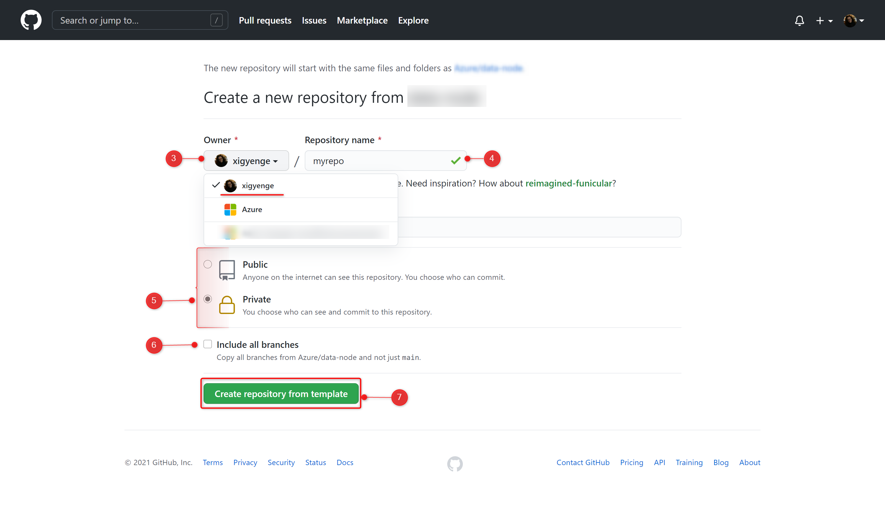

# Enterprise Scale Analytics - Data Landing Zone

> **General disclaimer** Please be aware that this template is in public preview. Therefore, expect smaller bugs and issues when working with the solution. Please submit an Issue, if you come across any issues that you would like us to fix.


# Quickstart

| Data Landing Zone |
|:--------------|
[](https%3A%2F%2Fraw.githubusercontent.com%2FAzure%2Fdata-node%2Fmain%2Fdocs%2Freference%2Fdeploy.dataNode.json)

# Description 
A Data Landing Zone has several layers to enable agility to service the Data Domains and Data Products under the data landing zone. A new Data Landing Zone is always deployed with a standard set of services to enable the entity to start ingesting and analysing data.

## What will be deployed?

By default, all the services which comes under Data Landing Zone are enabled and you must explicitly disable them if you don't want it to be deployed. 
    <p align="center">
         
    </p>


 - [Azure Virtual Network](https://docs.microsoft.com/en-us/azure/virtual-network/virtual-networks-overview)
 - [Network Security Groups](https://docs.microsoft.com/en-us/azure/virtual-network/network-security-groups-overview)
 - [Route Tables](https://docs.microsoft.com/en-us/azure/virtual-network/virtual-networks-udr-overview)
 - [Azure Key Vault](https://docs.microsoft.com/en-us/azure/key-vault/general)
 - [Storage Account](https://docs.microsoft.com/en-us/azure/storage/common/storage-account-overview)
 - [Data Lake Storage Gen2](https://docs.microsoft.com/en-us/azure/storage/blobs/data-lake-storage-introduction)
 - [Azure Data Factory](https://docs.microsoft.com/en-us/azure/data-factory/)
 - [Self Hosted Integration Runtime](https://docs.microsoft.com/en-us/azure/data-factory/create-self-hosted-integration-runtime)
 - [Log Analytics](https://docs.microsoft.com/en-us/azure/azure-monitor/learn/quick-create-workspace)
 - [SQL Server](https://docs.microsoft.com/en-us/sql/sql-server/?view=sql-server-ver15)
 - [Azure SQL Database](https://docs.microsoft.com/en-us/azure/azure-sql/database/)
 - [Synapse Workspace](https://docs.microsoft.com/en-us/azure/synapse-analytics/)
 - [Azure Databricks](https://docs.microsoft.com/en-us/azure/databricks/)
 - [Event Hub](https://docs.microsoft.com/en-us/azure/event-hubs/)

    
# Getting started

## 1. Prerequisites

@marvinbuss @AnalyticJeremy will need to see how we formulate here. For testing purposes as discussed we can use 1 subscription for both Data management and landing zone deployment. How do you think we can phrase this in the prerquisites? 

The following prerequisites are required to make this repository work:
- At least 1 Azure subscription used as Data Landing Zone which is connected to the Data Management Subscription 
- Contributor access to the Azure subscription

If you don’t have an Azure subscription, create a free account before you begin. Try the [free version of Azure](https://azure.microsoft.com/en-in/free/).

## 2. Create repository from a template
TODO - add screenshots
1. On GitHub, navigate to the main page of the repository.
2. Above the file list, click **Use this template**

<p align="center">
  
</p>

3. Use the **Owner** drop-down menu, and select the account you want to own the repository.
<p align="center">
  
</p>

4. Type a name for your repository, and an optional description.
5. Choose a repository visibility. 
6. Optionally, to include the directory structure and files from all branches in the template, and not just the default branch, select **Include all branches**.
7. Click **Create repository from template**.

## 3. Setting up the required secrets

A service principal needs to be generated for authentication and getting access to your Azure subscription. Just go to the Azure Portal to find the details of your subscription. Then start your preffered CLI and execute the following commands to generate the required credentials:

**Azure CLI**
```sh
# Replace {service-principal-name} and {subscription-id}  with your 
# Azure subscription id and any name for your service principle
az ad sp create-for-rbac --name {service-principal-name} \
                         --role contributor \
                         --scopes /subscriptions/{subscription-id} \
                         --sdk-auth
```

**Azure Powershell**
```sh
New-AzADServicePrincipal -DisplayName {service-principal-name} -Role contributor -Scope "/subscriptions/{subscription-id}"
```
This will generate the following JSON output:

```sh
{
  "clientId": "<GUID>",
  "clientSecret": "<GUID>",
  "subscriptionId": "<GUID>",
  "tenantId": "<GUID>",
  (...)
}
```

Add this JSON output as [a secret](https://help.github.com/en/actions/configuring-and-managing-workflows/creating-and-storing-encrypted-secrets#creating-encrypted-secrets) with the name `AZURE_CREDENTIALS` in your GitHub repository:

<p align="center">
  
</p>

To do so, click on the Settings tab in your repository, then click on Secrets and finally add the new secret with the name `AZURE_CREDENTIALS` to your repository.

Please follow [this link](https://help.github.com/en/actions/configuring-and-managing-workflows/creating-and-storing-encrypted-secrets#creating-encrypted-secrets) for more details. 
# Parameter Update Process

In order to connect GitHub actions to the desired Azure account and deploy the resources with your preffered inputs, you'll need to modify the parameters in the ARM parameter files. As updating each parameter file manually is a time consuming process, which could lead as well to undesired user errors, you can simplify the process by running the <a href="/.github/workflows/updateParameters.yml">`/.github/workflows/updateParameters.yml"` file</a>. Just click on the link and edit the following environment variables: 


```sh
env:
  GLOBAL_DNS_RESOURCE_GROUP_ID: '<my-global-dns-resource-group-resource-id>'
  DATA_LANDING_ZONE_SUBSCRIPTION_ID: '<my-data-landing-zone-subscription-id>'
  DATA_LANDING_ZONE_NAME: '<my-data-landing-zone-name>'  # Choose ~5 characters. Will be used as a prefix for services. If not unique, deployment can fail for some services.
  LOCATION: '<my-region>'
  SYNAPSE_STORAGE_ACCOUNT_NAME: '<my-synapse-storage-account-name>'
  SYNAPSE_STORAGE_ACCOUNT_FILE_SYSTEM_NAME: '<my-synapse-storage-account-file-system-name>'
  AZURE_RESOURCE_MANAGER_CONNECTION_NAME: '<my-resource-manager-connection-name>'
  HUB_VNET_ID: '<my-hub-vnet-id>'
```

| Parameter | Description 
|:-------------------------|:-------------|
| GLOBAL_DNS_RESOURCE_GROUP_ID | The global DNS Resource group resource ID which is inside the Data Management Subscription|
| DATA_LANDING_ZONE_SUBSCRIPTION_ID | The subscription ID of the Data Landing Zone where all the resources will be deployed
| DATA_LANDING_ZONE_NAME | The name of your Data Landing Zone 
| LOCATION | The region where you want the resources to be deployed
| SYNAPSE_STORAGE_ACCOUNT_NAME | The Synapse Storage Account name 
| SYNAPSE_STORAGE_ACCOUNT_FILE_SYSTEM_NAME | The Synapse Storage Account File System name
| AZURE_RESOURCE_MANAGER_CONNECTION_NAME | The Resource Manager Connection name. More details on how to create the connection name can be found [here](https://docs.microsoft.com/en-us/azure/devops/pipelines/library/service-endpoints?view=azure-devops&tabs=yaml) and in the following subsection
| HUB_VNET_ID | The VNet ID from the Data Management Subscription that will be peered with the new VNet deployed inside the Data Landing Zone

### Creating the Azure Resource Manager Connection
To allow Azure DevOps Server to be integrated with Azure services, you will need to create an Azure Service Principal that will allow the deployments. The name of this connection will be parsed in the environment variables inside the workflow deployment. 

>  Note: Please make sure you have the right priviliges to create a Service Principal inside your subscription.

 1. On your Azure DevOps Project, navigate to **Project Settings** and Select **Service Connections**. 
 2. From the **New service connection** dropdown, select **Azure Resource Manager** (automatic or manual)
    <p align="center">
    
    </p>


 3. Set the **Connection name** to something descriptive. You will need to create a service principal in Azure in the next task to fill out the remaining fields. For this, please follow the instructions from *3. Setting up the required secrets*
 4. Now that you have completed the requried fields, click **Verify connection** to make sure the values work as expected. Click **OK** when verified. You will now be able to reference this connection from release pipeline tasks and parse the name in the env variable **AZURE_RESOURCE_MANAGER_CONNECTION_NAME**
    <p align="center">
     
    </p>


Once you save your changes to the file, one last step to complete. Please update the GitHub Workflow environment variables in <a href="/.github/workflows/dataNodeDeployment.yml">`/.github/workflows/dataNodeDeployment.yml"` file</a>. 
After completing, just commit and make a Pull Request so the workflow will trigger and run the <a href="/configs/UpdateParameters.ps1">`/configs/UpdateParameters.ps1"` file</a>, which is updating all the variables used in the ARM Templates and you will be ready to deploy the services. 


<!-- ## Setup for GH Workflows

## Setup for ADO Workflow

### Access Requierements -->

# Connecting ADO to GitHub to deploy through ADO
In case you want to deploy the templates through ADO, please follow the below steps on how to integrate ADO with GitHub using Azure DevOps pipeline. 
### Prerequisites
* An Azure DevOps account from https://dev.azure.com.
* A GitHub account from https://github.com.

**1. Forking the GitHub repo** 

1. If you are not signed in to GitHub, sign in now.
2. Choose the repository that you wish to connect to Azure DevOps. In case you do not have any repositories forked, please follow the instructions from *2. Create repository from a template*
3. Click **Marketplace** from the top navigation to visit it and search for **Azure Pipelines**. The Azure Pipelines offering is free for anyone to use for public repositories, and free for a single build queue if you’re using a private repository. 
        <p align="center">
         
         </p>

4. Select it and click on **Install it for free**
        <p align="center">
        
        </p>
5. If you have multiple **GitHub** accounts, select the one you forked this repository to from the **Switch billing account** dropdown. 
6. You may be prompted to confirm your GitHub password to continue. 
7. You may be prompted to log in to your Microsoft account. Make sure you are loged into the one associated with your Azure DevOps account.


**2. Configuring Azure Pipelines project**

1. Now you will need to set up your Azure Pipelines project. Create (or select in case you have already created) the Azure DevOps **organization** you would like to perform these builds under, as well as the Azure DevOps **project** from that organization you would like to use.  Click **Continue**.
     <p align="center">
    
    </p>

2.  Select **Pipelines** and click on **Create** button in order to create a new pipeline.
    <p align="center">
    
    </p>
 
3. Choose where your code is - in this scenario, you have your code in the forked GitHub Repo, therefor, you will choose GitHub using Yaml.
    <p align="center">
    
    </p>
    
4. Once you choose the source, search after your forked repository, in this example **data-node** inside **My Repositories** and select it. 
      <p align="center">
    
    </p>
    
5. In case you have not installed Azure Pipelines in the prior steps, you will be prompted a window for installing it now and allowing to access the app. 
6. After connected to the forked repo, you will need to configure your pipeline. You can either start a new pipeline which you will work on or you can use an existing yaml file. For this project, you will use the existing yaml file which exists in your forked repo. Now, you just need to choose the **branch** on which you will work on and select the path to the ADO workflow file. 
    <p align="center">
        
    </p>
    
7. Click **run** to save the pipeline and queue a new build. It will take some minutes for the pipeline to complete. During this time it will configure the build agent, pull in the source from GitHub, and build it according to the pipeline definition.


# Contributing

This project welcomes contributions and suggestions.  Most contributions require you to agree to a
Contributor License Agreement (CLA) declaring that you have the right to, and actually do, grant us
the rights to use your contribution. For details, visit https://cla.opensource.microsoft.com.

When you submit a pull request, a CLA bot will automatically determine whether you need to provide
a CLA and decorate the PR appropriately (e.g., status check, comment). Simply follow the instructions
provided by the bot. You will only need to do this once across all repos using our CLA.

This project has adopted the [Microsoft Open Source Code of Conduct](https://opensource.microsoft.com/codeofconduct/).
For more information see the [Code of Conduct FAQ](https://opensource.microsoft.com/codeofconduct/faq/) or
contact [opencode@microsoft.com](mailto:opencode@microsoft.com) with any additional questions or comments.
