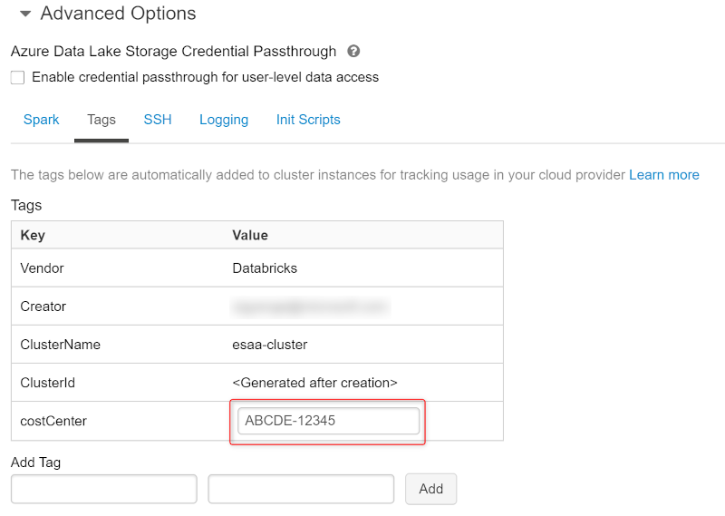
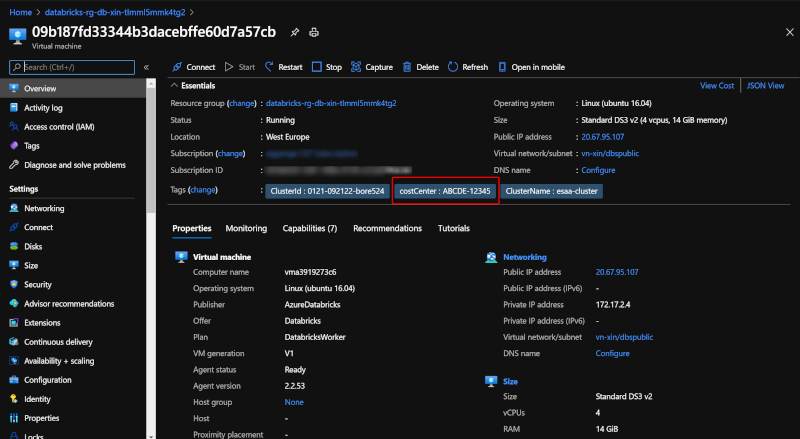

# Policies

## Azure Databricks Policies

**Enforcing Tags**

Cluster tags allow to easily monitor the cost of cloud resources used by various groups in an organization. More information regarding tags can be found [here](https://docs.microsoft.com/en-us/azure/databricks/administration-guide/account-settings/usage-detail-tags-azure#tag-propagation)

> **Note:** By default, Azure Databricks applies the following tags to each cluster: **Vendor**, **Creator**, **ClusterName** and **ClusterId**

In this implementation, **Regex policy** is used in order to enforce cost center tags definition when user creates a new Databricks cluster. As a result, Azure Databricks applies these tags to the cloud resources like VMs and disk volumes associated to the specific cluster.

 In this case the custom policy JSON section will be the following:

```json
     "custom_tags.costCenter": {
        "type": "regex",
        "pattern": "[A-Z]{5}-[0-9]{5}",
        "isOptional": false,
        "hidden": false
    }
```

By setting the value of **"isOptional"** to *false*, it prevents the creation of a cluster without specifying a costCenter with a value which needs to follow the defined pattern ( length of 11 chars, with 5 uppercase chars followed by "-", followed by 5 numbers).



As a result, when the cluster is created, the VMs provisioned in the Managed Resource Group will have assigned the defined cost tag.

